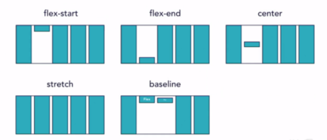
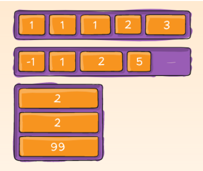

## Flexbox
Flex container per usare flexbox, quindi imposta display: flex su un qualsiasi elemento della nostra pagina:
```html
<div style="display:flex"></div>
```

### Flex-wrap: wrap
Il valore di default è flex-wrap: nowrap e fa sì che tutto sia posizionato in una sola riga, da sinistra verso destra. flex-wrap: wrap consentirà agli elementi di passare alla riga successiva una volta esaurito lo spazio nella prima. Gli elementi vengono disposti da sinistra a destra.

Dare il flex-wrap: wrap al div padre

```html
<div style="display:flex; flex-wrap: wrap;">
    <div></div>
</div>
```

## Align-items
Agisce sull'asse secondario.
- flex-start: si mettono attaccati al top;

- flex-end: si mettono attaccati al bottom;

- center: si mettono in mezzo;

- stretch: i div li allunga;

- baseline: allinea rispetto alla linea di testo;


## Justify-content
- flex-start - allinea alla fine della pagina a sinistra;

- flex-end - allinea alla fine della pagina a destra;

- center - Mette in mezzo i div;

- space-between - Distanzia i div in modo omogeneo, non dando alcuno spazio ai lati;

- space-around - Da lo spazio ad ogni div in modo omogeneo, ma senza all'inizio e alla fine;

- space-evenly - Da lo spazio ad ogni div in modo omogeneo;


## Align-content
- flex-start - Tutti all'inizio

- flex-end - Tutti alla fine

- center - In mezzo

- space-around - Da spazio a tutti i div

- space-between - 

- stretch(default) -


### Align-self
Cambia aling-item solo per un elemento specifico


### Order
É possibile definire l'ordine personalizzato dei div figli di flex.
