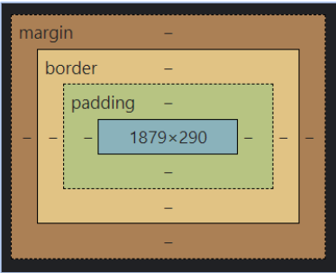

## HTML - <head> & <body>
Ogni pagina HTML deve avere un tag <html>

Dentro questo tag solitamente troviamo 2 figli:

- <head> ⇐ Contiene la configurazione della pagina
- <body> ⇐ Contiene il contenuto della pagina

```html
<!DOCTYPE html>
<html lang="en">
<head>
    <meta charset="UTF-8">
    <meta name="viewport" content="width=device-width, initial-scale=1.0">
    <title>Document</title>
</head>
<body>
    
</body>
</html>
```

## HTML - <head>
- Cose tipiche che inserirai nel tuo tag <head>

- Titolo della pagina
- Import di file esterni (Styles, Fonts, Script)
- Metadata per SEO (strumenti per Analytics e Ads)
- Metadata da condividere sui social (Facebook, Twitter etc)

- Ricorda: <head> => configurazione pagina 
(nella tua “testa” (head in inglese) c’è il cervello, cioè la tua configurazione!)

## h1 - h6 → Titoli
-h1, h2, h3, h4, h5, h6 sono i tag per i titoli

- Ogni pagina deve avere un solo h1, sarà l'elemento più importante per molti motori di ricerca

- Esempio: <h2> Questo è un sottotitolo </h2>

## p → Paragrafo
- p è il tag paragrafo

- Di solito contiene testo 

- è un elemento di “blocco”, cioè si espande per tutta la larghezza della pagina

- Esempio: <p> Questo è un paragrafo</p>

## span
- span è un contenitore di testo generico

- Di solito viene utilizzato per definire lo stile di certe porzioni di testo

- Esempio: <span> Questo è un testo </span>

## Liste: <ul> & <ol>
- <ul> ⇒ lista non ordinata

- <ol> ⇒ lista ordinata

- Entrambi sono genitori di <li> (list item)

- Esempio :

```html
<ul>
	<li> primo elemento </li>
	<li> secondo elemento </li>
</ul>
```

## Gli attributi dei tags
- Gli attributi sono coppie chiave-valore utilizzate per configurare tag

- Alcuni attributi sono validi per tutti i tag (id, class, style)...

- …altri sono specifici di alcuni tag

- Esempio:

```html

```

### img> ⇒ Tag immagine
-  ⇒ viene utilizzato per eseguire il rendering di un'immagine in una pagina


- Richiede l'attributo src per impostare l'immagine


- Richiede l'attributo alt che verrà mostrato quando l'immagine non è disponibile 
 - Importante per l’accessibilità e la SEO!

-   è un tag self-closing:

- Esempio: 
```html

```

## <a> ⇒ Tag “àncora”
- <a> ⇒ collega a una pagina interna o esterna oppure ad un elemento interno

- Richiede l'attributo href per impostare l'URL dell'elemento a cui fare riferimento

- Tutti i figli di <a> saranno cliccabili e porteranno alla pagina indicata nell’href

- Esempio: 
```html
<a href=”google.com”> Go to Google </a>
```

### Altri tag
- HTML forms & inputs

- Tabelle HTML (non molto utilizzato per problemi di responsiveness)

- Tag HTML5 (semantici, video, audio…)

- Altri input per textarea, pulsanti di opzione, elenchi a discesa...

- Tag per lo stile (style) e il contenuto dinamico (script)

- …e il meglio deve ancora venire!

## Box model



### Alcuni esempi di proprietà CSS
- color: red; // imposta il colore del testo su rosso

- background-color: blue; // imposta il colore di sfondo sul blu

- margin-top: 10px; // imposta il margine in alto su 10 pixel

- font-weight: bold; // imposta il testo in grassetto

- border: 1px solid red; // crea un bordo rosso di 1 pixel attorno all'elemento

- padding: 10px; // creare un padding di 10 pixel per il contenuto dell'elemento

- text-align: center; // allinea il contenuto al centro

https://developer.mozilla.org/en-US/docs/Web/CSS/Reference

## CSS regole ereditarie
- Alcune regole, se impostate sull'elemento genitore, vengono automaticamente ereditate sugli elementi al suo interno

- esempio: 

```html
<div style=”color: red;”>
	<p> Lorem Ipsum </p> // il testo di p sarà in rosso
</div>
```

- L’ereditarietà non si applica a tutte le regole, ma solo ad alcune di esse

- esempio:

```html
<div style=”border: 2px solid green”>
	<p> Lorem Ipsum </p> // p non avrà un bordo
</div>
```

### Selettori per Tag
- Nel tuo file CSS esterno o nel tag <style> puoi specificare regole per ogni dato elemento con un tag specifico

- esempio:

```html
  div { // selettore
			border: 1px solid red; // regola
} // darà un bordo di 1px colore rosso a tutti i div della pagina
```

- Queste regole si applicheranno a TUTTI i tag della pagina

- Il nome del tag qui è usato come "selettore". Il selettore definisce a quali elementi verranno applicate le regole.
In questo caso, le regole verranno applicate a tutti i div della pagina

- È possibile creare selettori più complessi specificando più di un nome di tag

```html
esempio: div p {
			color: purple;
		} // tutti i paragrafi contenuti dentro un div avranno il colore viola
```